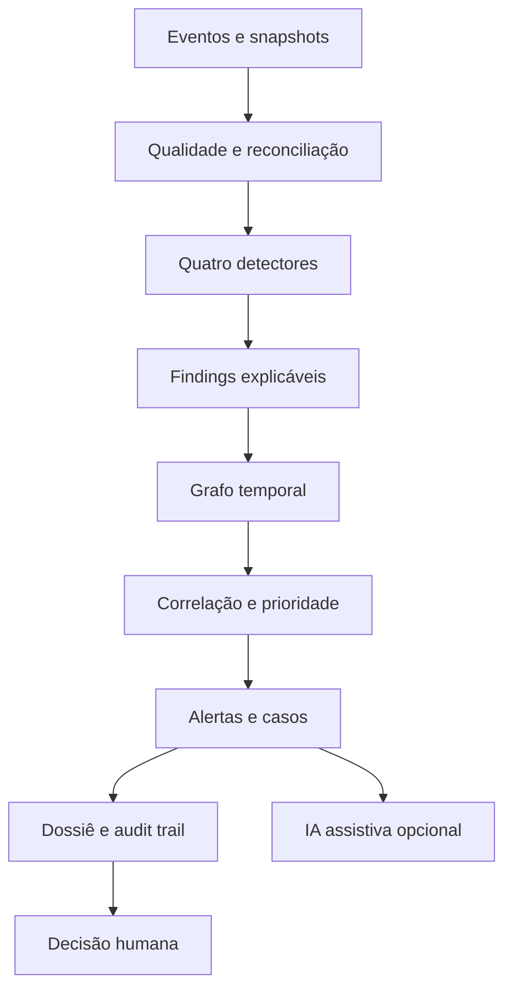

# VÉRTICE

## Plataforma de Inteligência Investigativa para Trade Surveillance

> Transforma eventos reconciliados em evidências, achados relacionados em casos e casos em decisões humanas auditáveis.

[](https://github.com/belemcrizan/Teste_monitoramento/actions/workflows/ci.yml)
[](https://www.python.org/)
[](LICENSE)

O VÉRTICE é uma implementação local-first e executável da arquitetura de referência para Surveillance, Compliance, Riscos e Tecnologia. Ele foi construído para validar comportamento, contratos e rastreabilidade antes de qualquer compromisso com infraestrutura AWS.

Ele cobre quatro eixos:

1. concentração e relacionamento recorrente;
2. comportamentos associados à manipulação;
3. churning e atividade potencialmente excessiva;
4. OTC complexo, estruturas e derivativos.

O sistema não declara culpa, intenção, fraude ou manipulação. Cada detector produz um `Finding` técnico com fórmulas, valores, reason codes, evidências, dados ausentes e limitações. O grafo temporal enriquece os achados antes da correlação; a prioridade organiza a fila; pessoas decidem.

## O que já é demonstrável

- contratos canônicos e timestamps conscientes de timezone;
- manifesto, reconciliação, qualidade e bloqueio fail-closed;
- quatro detectores independentes;
- `INCONCLUSIVE` quando falta evidência crítica;
- grafo temporal e relações com vigência;
- separação entre `Feature`, `Finding`, `Alert` e `Case`;
- score logístico versionado, com componentes e interações visíveis;
- criação idempotente de casos;
- máquina de estados e regra de quatro olhos;
- audit ledger encadeado por hash;
- dossiês e notas assistivas separados;
- fallback determinístico quando a IA falha;
- API REST, Swagger, painel demonstrativo e CLI;
- adaptadores testáveis para S3, SQS e Amazon Bedrock;
- testes automatizados e CI.

## Comece em menos de cinco minutos

Requer Python 3.11 ou superior.

```bash
python -m venv .venv
source .venv/bin/activate
python -m pip install -e ".[dev]"
vertice demo
```

No Windows PowerShell:

```powershell
py -3.12 -m venv .venv
.venv\Scripts\Activate.ps1
python -m pip install -e ".[dev]"
vertice demo
```

Saída esperada:

```text
VÉRTICE — execução concluída
quality: PASS
findings: ... | alerts: ... | cases: ...
scenario_coverage: 4/4
```

Os artefatos são gravados em `artifacts/<run_id>/`: dossiês, audit trail, notas assistivas, resultado consolidado e `REPORT.md`.

## Demonstração visual e API

```bash
vertice serve --host 127.0.0.1 --port 8000
```

Abra:

- painel: <http://127.0.0.1:8000/demo>
- Swagger: <http://127.0.0.1:8000/docs>
- health check: <http://127.0.0.1:8000/health>

No painel, selecione **Executar golden cases**. Os dados são sintéticos e exercitam sinais adversos, fluxo benigno, relacionamento temporal e valuation incompleto.

## Fluxo



## Três garantias importantes

### Ausência de dado não reduz silenciosamente o risco

Se patrimônio médio, referência contemporânea ou IPV estiver ausente, o resultado fica `INCONCLUSIVE` e explicita qual evidência precisa ser obtida.

### IA não está no caminho crítico

O dossiê determinístico e o caso são criados antes da nota assistiva. Timeout, resposta inválida ou indisponibilidade do modelo não elimina o caso.

### AWS é um destino de implantação, não uma dependência do domínio

O núcleo depende de portas como `ObjectStore`, `EventPublisher`, `CaseRepository` e `InvestigativeAssistant`. Localmente, usa arquivos e memória. Na AWS, os mesmos contratos recebem S3, SQS/EventBridge, Aurora e Bedrock. Detectores e regras não mudam.

| Capacidade | Local | AWS alvo |
|---|---|---|
| Evidência | JSON em filesystem | S3 com Versioning/Object Lock |
| Eventos | publisher em memória | SQS + EventBridge |
| Casos | repositório em memória | Aurora PostgreSQL |
| Grafo | enriquecedor em memória | Neptune |
| IA | resumo determinístico | Amazon Bedrock |
| Execução | processo/Docker | ECS Fargate/Step Functions |
| Observabilidade | logs e relatório | CloudWatch/CloudTrail |

Veja [Adoção AWS](docs/AWS_ADOPTION.md) para o plano por fases e as fronteiras que permanecem fora desta demonstração.

## Testes e validação

```bash
pytest
ruff check .
mypy src/vertice_surveillance
python -m build
```

Valide apenas a carga:

```bash
vertice validate --dataset demo
vertice validate --dataset benign
```

Os testes cobrem reconciliação, duplicidade crítica, os quatro detectores, caminho inconclusivo, benign case, replay idempotente, falha da IA, grafo, score, quatro olhos, audit trail, API e adaptadores AWS com clientes falsos.

## Documentação por público

| Se você é… | Comece por |
|---|---|
| Comitê, diretoria ou CTO | [Visão executiva](docs/EXECUTIVE_OVERVIEW.md) |
| Analista de Surveillance/Compliance | [Guia de demonstração](docs/DEMO_GUIDE.md) e [walkthrough do caso](docs/TRACE_WALKTHROUGH.md) |
| Engenharia/Arquitetura | [Arquitetura](docs/ARCHITECTURE.md) e [contratos](docs/DATA_CONTRACTS.md) |
| Cloud/Plataforma | [Adoção AWS](docs/AWS_ADOPTION.md) e [deploy/aws](deploy/aws/README.md) |
| Model Risk/Auditoria | [Validação](docs/VALIDATION.md) e [segurança/governança](docs/SECURITY_GOVERNANCE.md) |
| Estagiário ou novo integrante | Este README e [glossário](docs/GLOSSARY.md) |

## Limites honestos

Esta versão prova que a arquitetura é implementável e testável. Ela não prova eficácia com dados reais, recall regulatório, performance em escala, aderência jurídica automática ou prontidão de produção. Os thresholds são ilustrativos; os golden cases são sintéticos; o armazenamento transacional local não substitui Aurora; e não há alegação de spoofing/layering sem order lifecycle e livro de ofertas.

Leia [Limitações e não alegações](docs/LIMITATIONS.md) antes de apresentar resultados.

## Licença

Apache License 2.0. Consulte [LICENSE](LICENSE).

