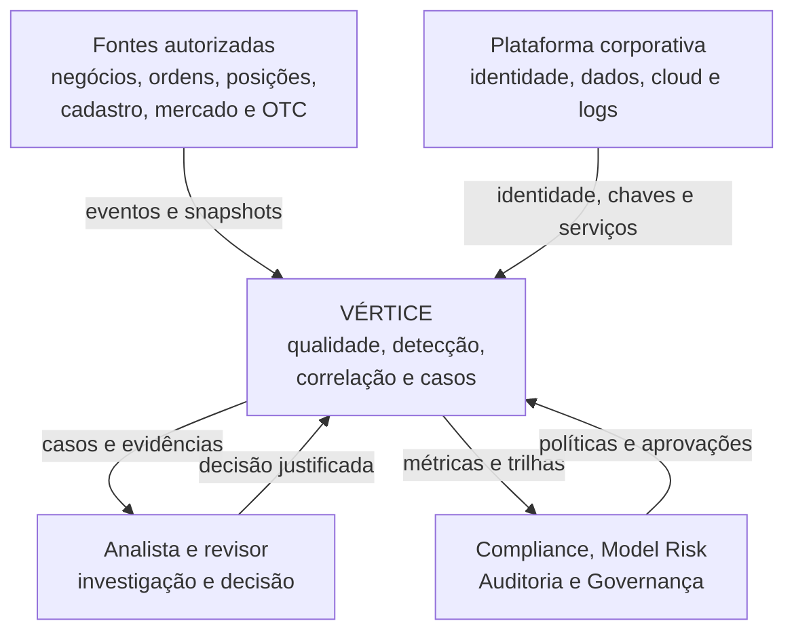
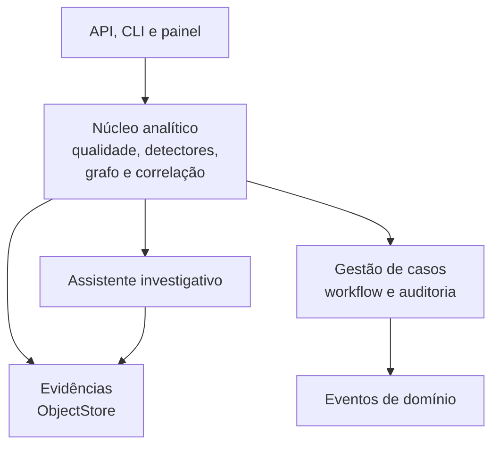
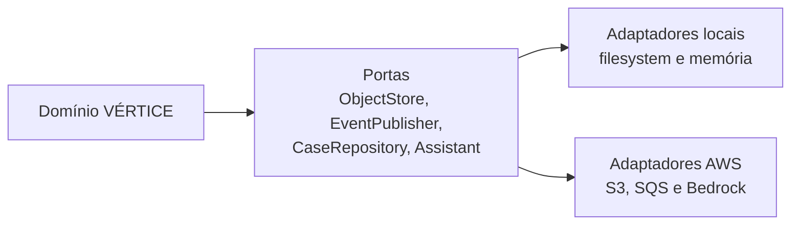
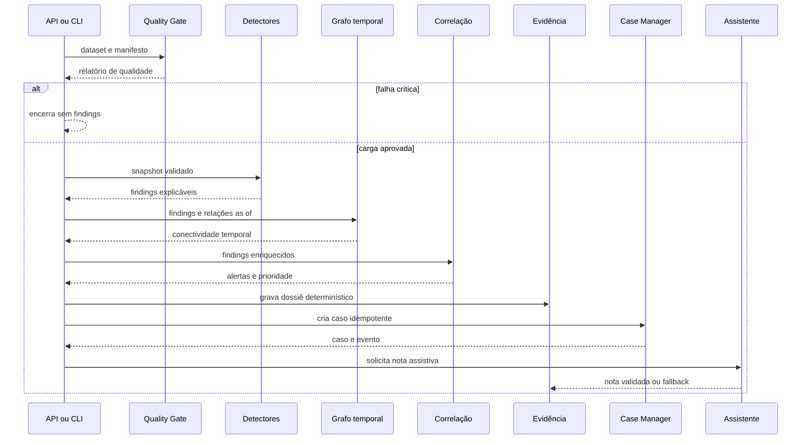
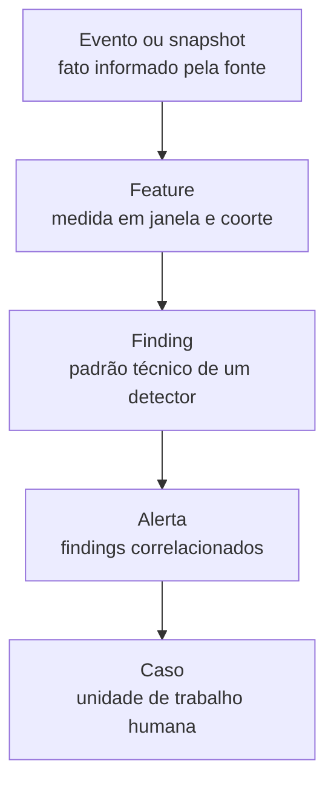
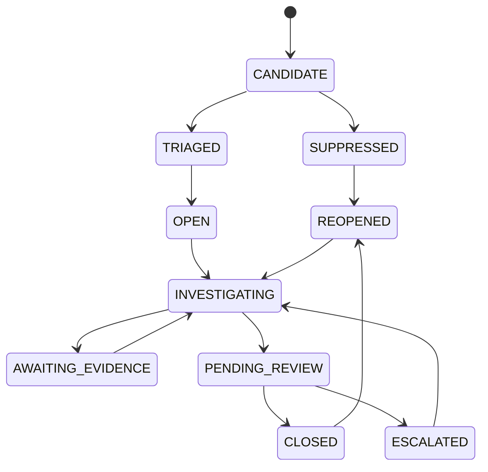
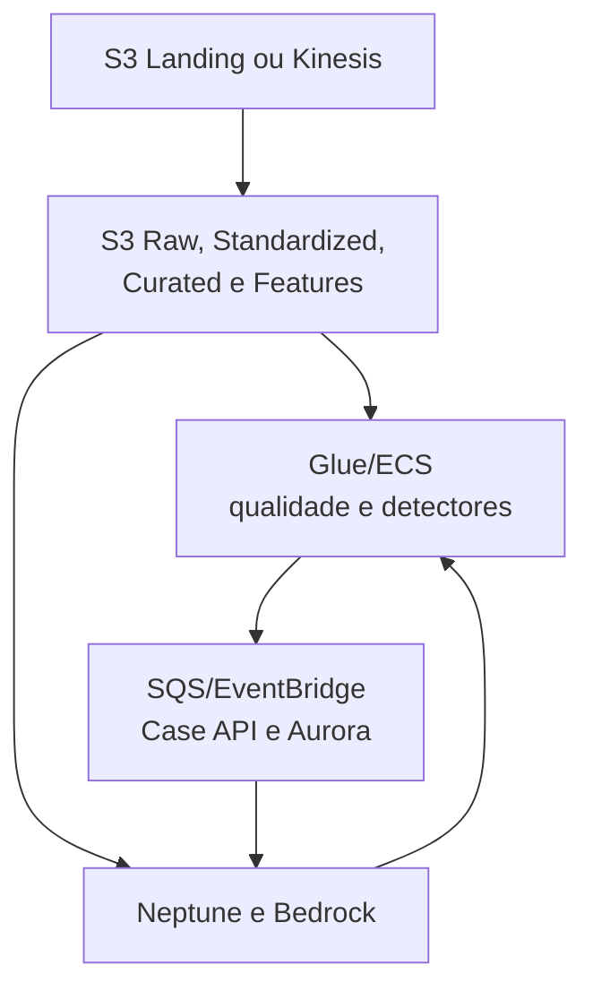

# Arquitetura completa do VÉRTICE

## Plataforma de Inteligência Investigativa para Trade Surveillance

| Metadado | Valor |
|---|---|
| Documento | Arquitetura de solução, software, dados, segurança e implantação |
| Versão | 1.0 |
| Atualizado em | 28 de agosto de 2026 |
| Estado da solução | Executável localmente; preparada para adoção incremental na AWS |
| Repositório | `belemcrizan/Teste_monitoramento` |
| Público | Negócio, Surveillance, Compliance, Riscos, Auditoria, Engenharia, Segurança, Cloud e Operações |

> O VÉRTICE transforma eventos reconciliados em evidências técnicas, correlaciona achados, organiza casos e preserva a decisão humana. Um alerta ou score nunca representa culpa, intenção, fraude ou recomendação automática de sanção.

---

## 1. Como ler este documento

Não é necessário conhecer programação ou AWS para entender as primeiras seções.

| Se você é… | Leia primeiro |
|---|---|
| Comitê, diretoria ou sponsor | seções 2 a 5 e 24 |
| Surveillance, Compliance ou analista | seções 5, 8, 9, 11 e 12 |
| Engenharia ou arquitetura | seções 6 a 18 |
| Cloud, Segurança ou SRE | seções 14 a 21 |
| Model Risk, Auditoria ou Validação | seções 8 a 13 e 22 a 24 |
| Novo integrante | seções 2, 4, 5 e o [glossário](GLOSSARY.md) |

### 1.1 Legenda de estado

O documento distingue o que existe agora do que depende da integração institucional.

| Marcador | Significado |
|---|---|
| **Implementado** | existe no código, possui caminho executável e teste automatizado |
| **Parcial** | existe uma interface, template ou adaptador, mas falta requisito de produção |
| **Alvo AWS** | arquitetura proposta; precisa de infraestrutura, segurança e aceite institucional |
| **Decisão pendente** | depende de dados, política, volume, jurídico ou padrão corporativo |

---

## 2. Resumo executivo

O VÉRTICE é uma plataforma investigativa de Trade Surveillance com quatro objetivos:

1. validar integridade e suficiência dos dados antes de calcular sinais;
2. detectar padrões técnicos em quatro eixos independentes;
3. relacionar esses sinais sem transformar correlação em conclusão;
4. entregar um caso rastreável para análise e decisão humana.

A solução foi desenhada como **local-first e cloud-ready**. O mesmo núcleo de domínio executado em uma estação de trabalho pode ser empacotado em container e receber adaptadores AWS sem reescrever detectores, contratos, regras ou workflow.

### 2.1 O que está demonstrável

- contratos canônicos validados;
- manifesto, reconciliação e quality gate fail-closed;
- detectores de concentração, comportamento associado à manipulação, churning e OTC complexo;
- tratamento explícito de evidência degradada e resultado inconclusivo;
- grafo temporal antes da priorização;
- separação entre evento, feature, finding, alerta e caso;
- prioridade operacional explicável e versionada;
- casos idempotentes, máquina de estados e regra de quatro olhos;
- trilha de auditoria encadeada por hash;
- API, Swagger, painel demonstrativo, CLI e artefatos JSON;
- adaptadores para filesystem, memória, S3, SQS e Bedrock;
- suíte automatizada e CI para Python 3.11, 3.12 e 3.13.

### 2.2 O que não deve ser inferido

A solução atual não comprova eficácia regulatória com dados reais, capacidade de produção, recall, precisão, segurança institucional completa ou aderência jurídica automática. Aurora, Neptune, Kinesis, autenticação corporativa, infraestrutura como código e disaster recovery são etapas do alvo AWS, não funcionalidades ocultas ou falsamente simuladas.

---

## 3. Drivers e princípios arquiteturais

### 3.1 Drivers

| Driver | Consequência arquitetural |
|---|---|
| Explicabilidade | todo finding contém features, reason codes, evidências, ausências e limitações |
| Qualidade antes da detecção | falha crítica bloqueia análise; nulo não vira zero |
| Investigação humana | prioridade organiza fila; decisão permanece com pessoas autorizadas |
| Auditabilidade | IDs, versões, evidências e transições permitem reconstruir o caminho |
| Replay e idempotência | a mesma entrada e política geram as mesmas identidades lógicas |
| Quatro cenários independentes | cada detector tem dados mínimos e caminho inconclusivo próprios |
| Adoção AWS sem lock-in do domínio | SDKs de cloud ficam nos adaptadores |
| Segurança e privacidade | acesso mínimo, tokenização, retenção decidida e IA fora do caminho crítico |
| Evolução incremental | golden cases → shadow → UAT → produção controlada |

### 3.2 Princípios

1. **Evidence first:** evidência congelada antes de resumo assistivo.
2. **Fail closed para integridade:** divergência crítica impede resultado analítico.
3. **Fail safe para assistência:** indisponibilidade de IA não elimina caso.
4. **Inconclusivo é resultado válido:** falta de dado crítico cria trabalho de obtenção de evidência.
5. **Tempo é parte do dado:** evento, atualização, ingestão, processamento e vigência não são equivalentes.
6. **Grafo enriquece, não condena:** relação temporal adiciona contexto e nunca prova intenção.
7. **Score não é soma arbitrária:** componentes e interações são versionados e explicados.
8. **Configuração não substitui governança:** thresholds ilustrativos precisam de backtest e aprovação.
9. **Cloud é adaptador:** o domínio não importa `boto3`.
10. **Sem alegações além da evidência:** não há classificação de spoofing/layering sem ciclo de ordens e livro de ofertas adequados.

---

## 4. Contexto do sistema



### 4.1 Atores

| Ator | Responsabilidade |
|---|---|
| Sistema de origem | fornecer registros completos, identificáveis e reconciliáveis |
| Data Owner/Steward | definir semântica, qualidade, classificação e owner do dado |
| Analista | investigar evidências, contrafatos, contexto e dados ausentes |
| Revisor/manager | aplicar quatro olhos e aprovar fechamento ou escalonamento |
| Compliance/Surveillance | definir cenários, política, materialidade e uso aceitável |
| Model Risk/Validação | desafiar metodologia, thresholds, estabilidade e limitações |
| Engenharia | manter contratos, pipeline, testes, replay e integrações |
| Cloud/SRE | operar infraestrutura, capacidade, observabilidade e recuperação |
| Segurança/Privacidade | controlar identidade, acesso, criptografia, egress, retenção e PII |
| Auditoria | verificar linhagem, versões, decisões e integridade da trilha |

### 4.2 Fronteira do VÉRTICE

O VÉRTICE recebe dados autorizados e produz artefatos investigativos. Não executa ordens, não altera posições, não aplica sanção, não comunica regulador automaticamente e não substitui o sistema oficial de cadastro, pricing, books and records ou Case Manager corporativo.

---

## 5. Capacidades e estado atual

| Capacidade | Estado atual | Alvo institucional |
|---|---|---|
| Ingestão | dataset em processo/CLI | S3 Landing e Kinesis |
| Contratos | Pydantic, campos extras proibidos | catálogo, schema registry e versionamento formal |
| Qualidade | manifesto, duplicidade e referências | Glue Data Quality e quarentena |
| Evidência | JSON atômico em filesystem | S3 Versioning, KMS e Object Lock aprovado |
| Detecção | quatro detectores | execução distribuída e calibrada |
| Grafo | relações temporais em memória | Neptune após sizing e entity resolution |
| Correlação | agrupamento por sujeito | serviço escalável com histórico institucional |
| Prioridade | função logística configurável | política calibrada, monitorada e aprovada |
| Casos | repositório em memória | Aurora PostgreSQL/Case Manager corporativo |
| Eventos | publisher em memória ou SQS | outbox, EventBridge, DLQ e consumidores idempotentes |
| IA | fallback ou Bedrock `converse` | modelo aprovado, guardrails e avaliação contínua |
| Interface | API, Swagger e painel de demonstração | UI corporativa integrada a SSO |
| Auditoria | ledger em memória e artefato JSON | storage transacional/imutável e CloudTrail |
| Observabilidade | métricas do run e logs do processo | CloudWatch, tracing, alarmes e dashboards |
| Implantação | Python/container | ECR, ECS Fargate e Step Functions |

---

## 6. Visão de containers

O diagrama abaixo mostra unidades lógicas. Na execução local, algumas rodam no mesmo processo; na AWS, podem ser separadas.



### 6.1 Responsabilidades

| Container lógico | Responsabilidade | Não deve fazer |
|---|---|---|
| API/CLI | receber comando, expor resultado e iniciar execução | decidir prioridade ou alterar evidência |
| Núcleo analítico | validar, detectar, enriquecer e correlacionar | conhecer S3, SQS ou Bedrock |
| Gestão de casos | persistir caso, validar transição e publicar evento | recalcular detector |
| ObjectStore | gravar e recuperar JSON por referência | interpretar conteúdo investigativo |
| Assistente | resumir somente fatos do dossiê | criar, suprimir, fechar ou escalar caso |
| EventPublisher | publicar envelope estável | assumir entrega exatamente uma vez |

---

## 7. Arquitetura de software

O projeto segue arquitetura hexagonal: o núcleo conhece **portas**; infraestrutura fornece **adaptadores**.



### 7.1 Mapa do código

| Caminho | Responsabilidade |
|---|---|
| `models.py` | contratos canônicos e objetos do domínio |
| `quality.py` | quality gate, manifesto e reconciliação |
| `detectors/` | detectores independentes |
| `graph.py` | enriquecimento por relações vigentes |
| `risk.py` | correlação e prioridade explicável |
| `cases.py` | caso, transições, quatro olhos e eventos |
| `audit.py` | registros append-only encadeados por hash |
| `pipeline.py` | ordem de execução e degradação segura |
| `ports.py` | protocolos independentes de infraestrutura |
| `adapters/local.py` | filesystem, memória e assistente determinístico |
| `adapters/aws.py` | S3, SQS e Bedrock com clientes injetáveis |
| `bootstrap.py` | composição de adaptadores conforme ambiente |
| `config.py` | política validada e versionada |
| `settings.py` | configuração por variáveis de ambiente |
| `api.py` | REST, Swagger e painel demonstrativo |
| `cli.py` | comandos `demo`, `validate` e `serve` |
| `reporting.py` | relatório legível do run |
| `sample_data.py` | golden cases e controle benigno sintéticos |

### 7.2 Regra de dependência

- domínio pode depender de modelos e portas;
- adaptadores podem depender do domínio e de SDKs;
- domínio não pode depender de adaptadores;
- bootstrap é o único ponto de composição;
- detectores não acessam rede, banco ou filesystem.

Essa regra permite testar cada detector com dados sintéticos e trocar infraestrutura sem alterar sua assinatura.

---

## 8. Fluxo ponta a ponta implementado



### 8.1 Ordem e garantias

1. O `run_id` é derivado de versão do pipeline, snapshot e `as_of`.
2. O quality gate roda antes de qualquer detector.
3. Findings só são calculados quando a carga passa no gate global.
4. Relações são avaliadas na vigência correta.
5. Findings do mesmo sujeito são correlacionados.
6. Só prioridades `HIGH`, `CRITICAL` ou `INCONCLUSIVE` criam caso no slice atual.
7. O dossiê é persistido antes do caso e antes da IA.
8. Uma falha da IA produz nota de indisponibilidade; caso e evidência permanecem.
9. O resultado e a trilha de auditoria são persistidos ao final.

### 8.2 Artefatos locais

```text
artifacts/<run_id>/
├── run.json
├── audit.json
├── REPORT.md
├── evidence/
│   └── <alert_id>.json
└── assistant/
    └── <case_id>.json
```

---

## 9. Modelo de informação

### 9.1 Cadeia semântica



| Objeto | Pergunta respondida | Exemplo |
|---|---|---|
| Evento | o que a fonte registrou? | execução confirmada |
| Feature | o que foi medido? | turnover bruto em uma janela |
| Finding | qual padrão técnico apareceu? | custo relativo elevado e giro alto |
| Alerta | quais achados do sujeito devem ser vistos juntos? | churning mais relação temporal |
| Caso | quem investigará e qual será a decisão? | caso em investigação |

Não se deve pular de evento para caso sem registrar cálculos, regra, evidência e política.

### 9.2 Contratos canônicos de entrada

| Contrato | Granularidade | Uso principal |
|---|---|---|
| `TradeEvent` | uma execução/negócio | concentração, preço e churning |
| `OrderEvent` | uma mudança de ordem | extensão futura com ciclo de ordens |
| `PositionSnapshot` | conta × instrumento × instante | exposição e patrimônio médio |
| `ClientSnapshot` | cliente × vigência | perfil, controle e suitability |
| `MarketReference` | instrumento × instante | referência contemporânea e dispersão |
| `OtcTrade` | estrutura × negócio | valuation, incerteza e complexidade |
| `RelationshipEdge` | relação × vigência | contexto temporal e conectividade |
| `LoadManifest` | extração/carga | reconciliação de contagem e financeiro |

Os detalhes de campos e nulabilidade estão em [Contratos de dados](DATA_CONTRACTS.md).

### 9.3 Semântica temporal

| Tempo | Significado |
|---|---|
| `event_time` | quando o fato econômico ocorreu |
| `source_update_time` | quando a origem registrou ou corrigiu |
| `ingest_time` | quando a plataforma recebeu |
| `receive_time` | quando um evento de ordem foi recebido |
| `started_at/completed_at` | quando o pipeline processou |
| `valid_from/valid_to` | intervalo de vigência de cadastro ou relação |
| `as_of` | fotografia lógica usada na análise |

A implementação exige timezone nos timestamps de `TradeEvent`. A integração institucional deve estender essa validação a todos os timestamps canônicos e normalizar armazenamento em UTC, preservando timezone de origem quando necessário para auditoria.

### 9.4 Nulos

Nulo significa “não informado ou não disponível”, nunca zero. Exemplos:

- patrimônio médio ausente pode tornar churning inconclusivo;
- IPV, modelo ou snapshot ausente pode gerar `INCONCLUSIVE_VALUATION`;
- contraparte ausente exclui o negócio da métrica por par;
- referência contemporânea ausente impede conclusão de padrão que dependa dela.

---

## 10. Qualidade, reconciliação e linhagem

### 10.1 Quality gate

O quality gate calcula contagem e financeiro bruto, identifica duplicidades, valida manifesto e verifica cobertura mínima.

| Condição | Tratamento |
|---|---|
| `trade_id` duplicado | bloqueio global |
| contagem divergente do manifesto | bloqueio global |
| financeiro divergente do manifesto | bloqueio global |
| cadastro crítico ausente | bloqueio dos cenários afetados |
| valuation OTC parcial | warning e caminho inconclusivo |
| referência não crítica ausente | execução degradada com limitação explícita |

### 10.2 Linhagem mínima

Cada saída deve ser rastreável a:

- `snapshot_id` e manifesto;
- registros ou referências de evidência;
- versão do contrato;
- versão do detector;
- versão da política;
- janela e `as_of`;
- commit/artefato de código no alvo de produção;
- versão de grafo/entity resolution;
- modelo e prompt, se houver nota assistiva.

### 10.3 Camadas de dados no alvo AWS

| Camada | Conteúdo | Regra |
|---|---|---|
| Landing | entrega como recebida | acesso restrito e prazo curto |
| Raw | cópia imutável, manifesto e metadados | base de replay e reconciliação |
| Quarantine | registros inválidos | correção controlada, nunca descarte silencioso |
| Standardized | contratos canônicos | tipos, unidades e timestamps normalizados |
| Curated | dados prontos para cenários | joins e regras de cobertura aprovados |
| Features | medidas versionadas por janela/coorte | reprodutíveis |
| Evidence | dossiês congelados por alerta/caso | retenção e legal hold definidos |

---

## 11. Arquitetura analítica

### 11.1 Detectores

| Eixo | Pergunta técnica | Evidência mínima | Limite importante |
|---|---|---|---|
| Concentração/relacionamento | há participação observada elevada e recorrência entre pares? | negócios, contraparte, janela | participação observada não é market share |
| Comportamento associado à manipulação | há desvio robusto de preço combinado a contexto relevante? | preço, referência, dispersão e negócios | não classifica spoofing/layering sem lifecycle/book |
| Churning/atividade excessiva | giro e custo relativo são elevados frente ao patrimônio? | negócios, fees, posição e equity | controle de decisão desconhecido degrada evidência |
| OTC complexo | preço/premium diverge do valor independente considerando incerteza? | negócio OTC, IPV, modelo, snapshot e liquidez | ausência de valuation gera inconclusivo |

Cada detector devolve `Finding` com:

- força, materialidade e urgência normalizadas;
- qualidade e disposição da evidência;
- `reason_codes`;
- valores das features;
- referências de evidência;
- dados ausentes;
- limitações.

### 11.2 Grafo temporal

O enriquecedor aceita apenas arestas vigentes no `as_of` e registra conectividade e reason codes. Cada relação contém origem, destino, tipo, fonte, confiança, método e intervalo de validade.

No estágio atual, o grafo é em memória. Neptune só deve ser adotado depois de:

- aprovar ontologia e entity resolution;
- medir volume e consultas;
- controlar falsos vínculos;
- definir rebuild a partir de Curated;
- validar autorização para atributos sensíveis.

Falha do grafo não deve apagar findings. O resultado deve registrar degradação e política aplicável.

### 11.3 Correlação

Findings são agrupados por `subject_id`. O motor usa máximos normalizados de força, materialidade, urgência, conectividade e histórico, além de interações explícitas.

```text
z = intercepto
    + w_força × força
    + w_materialidade × materialidade
    + w_urgência × urgência
    + w_conectividade × conectividade
    + w_histórico × histórico
    + interações aprovadas

prioridade = 100 / (1 + exp(-z))
```

Interações atuais:

- corroboração por múltiplos cenários;
- finding mais relação temporal relevante;
- concentração mais comportamento de preço.

O valor é **prioridade operacional**, não probabilidade de ilícito. Pesos e thresholds ficam em `configs/policy.example.json` e precisam de calibração antes de uso real.

### 11.4 Classes de prioridade

| Classe | Regra atual | Ação do slice |
|---|---:|---|
| `OBSERVATION` | abaixo de 30 | não cria caso |
| `TRIAGE` | 30 a 59,99 | não cria caso |
| `HIGH` | 60 a 79,99 | cria caso |
| `CRITICAL` | 80 ou mais | cria caso |
| `INCONCLUSIVE` | todos os findings inconclusivos | cria caso aguardando evidência |

Esses cortes são baseline demonstrativo. Produção exige análise de volume da fila, capacidade operacional, estabilidade e aprovação.

---

## 12. Gestão de casos e decisão humana

### 12.1 Estados



O modelo comporta o fluxo completo. No slice executável, casos acionáveis nascem em `OPEN` e casos inconclusivos em `AWAITING_EVIDENCE`; `CANDIDATE` e `TRIAGED` permanecem disponíveis para integração com intake institucional.

### 12.2 Regras implementadas

- transição fora do mapa é rejeitada;
- toda transição exige justificativa;
- o primeiro ator que inicia investigação vira investigador;
- fechamento e escalonamento exigem papel de revisão;
- investigador não pode revisar o próprio caso;
- cada mudança gera audit record e evento;
- criação usa ID determinístico e é idempotente.

### 12.3 Persistência de produção

O `CaseRepository` atual é em memória. O adaptador Aurora/Case Manager deve incluir:

- chave única por `case_id`;
- controle de versão ou optimistic locking;
- histórico append-only;
- outbox na mesma transação;
- inbox/idempotency para consumidores;
- timestamps do banco e identidade corporativa do ator;
- queries de fila, SLA, ownership e revisão;
- migrações, backup e restore testados;
- autorização server-side e segregação de funções.

---

## 13. Idempotência, replay e auditoria

### 13.1 Identidades estáveis

IDs lógicos são hashes canônicos das entradas que definem identidade:

| ID | Base lógica |
|---|---|
| Run | versão do pipeline + snapshot + `as_of` |
| Finding | detector/versão + sujeito + janela + evidência relevante |
| Alert | versão da correlação + sujeito + findings ordenados + snapshot |
| Case | alerta + versão da política |
| Evento | tipo + payload |

Timestamps operacionais podem variar sem mudar a identidade lógica.

### 13.2 Replay

Um replay confiável congela:

- snapshot e manifesto;
- código/commit e imagem;
- contratos e schemas;
- configuração e vigência da política;
- coortes e referências contemporâneas;
- versão de relacionamentos;
- modelo, prompt e parâmetros do assistente.

O replay deve comparar IDs, reason codes, classes, evidências e diferenças justificadas. Não basta comparar somente contagem final.

### 13.3 Auditoria

O ledger local encadeia registros com SHA-256: cada item carrega o hash anterior e o próprio hash. Isso demonstra detecção de adulteração, mas não substitui controle de acesso e imutabilidade de produção.

Três trilhas precisam convergir:

1. **dados:** ingestão, qualidade, transformação e acesso;
2. **máquina:** features, regras, score, versões e correlação;
3. **humano:** visualização, comentário, decisão, justificativa e revisão.

---

## 14. IA assistiva

### 14.1 Posição na arquitetura

A IA entra depois que o dossiê determinístico foi salvo e o caso criado. Ela pode resumir e sugerir próximos passos, mas não pode:

- criar ou suprimir finding;
- alterar score;
- abrir, fechar ou escalar caso;
- declarar culpa, fraude ou intenção;
- inventar referência de evidência.

### 14.2 Modos

| Modo | Uso |
|---|---|
| `DETERMINISTIC_FALLBACK` | resumo local sem modelo |
| Bedrock | resumo JSON factual com `source_refs` permitidos |
| `ASSISTANT_UNAVAILABLE` | nota explícita quando o modelo falha |

O adaptador Bedrock usa temperatura zero, exige chaves de saída e rejeita citações que não estejam no dossiê. Validação por afirmação, redaction, guardrails, avaliação de PII, circuit breaker e registro institucional de prompts ainda são requisitos do alvo.

### 14.3 Separação de conhecimento

- evidência do caso deve vir do dossiê autorizado;
- políticas e procedimentos podem vir de uma base RAG separada;
- conteúdo recuperado é dado não confiável, nunca instrução;
- toda recomendação deve manter fonte, incerteza e revisão humana.

---

## 15. Execução local

### 15.1 Topologia

```text
Usuário → CLI/API → pipeline no processo
                   ├── filesystem JSON
                   ├── casos em memória
                   ├── eventos em memória
                   └── assistente determinístico
```

### 15.2 Comandos

```bash
python -m venv .venv
source .venv/bin/activate
python -m pip install -e ".[dev]"
python -m vertice_surveillance demo --policy configs/policy.example.json
python -m vertice_surveillance serve --policy configs/policy.example.json
```

Painel: <http://127.0.0.1:8000/demo>

Swagger: <http://127.0.0.1:8000/docs>

Health: <http://127.0.0.1:8000/health>

### 15.3 Container

O `Dockerfile`:

- usa Python 3.12 slim;
- instala o extra AWS;
- executa com usuário não root;
- expõe a porta 8000;
- inclui health check;
- inicia `uvicorn vertice_surveillance.bootstrap:app`.

O `compose.yaml` usa filesystem read-only, `tmpfs` e `no-new-privileges`. Essa configuração é de demonstração e não representa hardening completo.

---

## 16. Arquitetura alvo AWS

### 16.1 Visão física



### 16.2 Mapeamento de serviços

| Capacidade | Serviço AWS proposto | Justificativa |
|---|---|---|
| Landing e evidência | Amazon S3 | versionamento, escala, lifecycle e integração |
| Criptografia | AWS KMS | chaves gerenciadas e separação por finalidade |
| Catálogo/qualidade | Glue Catalog/Data Quality | contratos e regras de cobertura |
| Lake access | Lake Formation | autorização fina e governança |
| Intradiário | Kinesis Data Streams | ordenação por chave e controle de lag |
| Fila de trabalho | SQS + DLQ | desacoplamento e retries |
| Roteamento | EventBridge | eventos de domínio e integrações |
| Processamento | ECS Fargate | execução do mesmo container |
| Orquestração | Step Functions | estados, retries e visibilidade |
| Casos | Aurora PostgreSQL | transações, constraints e queries operacionais |
| Relações | Neptune | consultas temporais após validação de sizing |
| Assistente | Amazon Bedrock | modelo governado e integração por API |
| Segredos | Secrets Manager/Parameter Store | rotação e acesso por role |
| Observabilidade | CloudWatch/X-Ray/CloudTrail | métricas, traces e auditoria de API |
| Imagens | ECR | scan, assinatura e tags imutáveis |
| Consulta analítica | Athena | investigação autorizada sobre o lake |
| Dashboards | QuickSight ou ferramenta corporativa | métricas agregadas, sem substituir Case UI |

O mapeamento é uma arquitetura de referência. Serviços equivalentes aprovados pela organização podem implementar as mesmas portas.

### 16.3 Contas e ambientes

Recomendação:

- contas separadas para desenvolvimento, homologação e produção;
- dados reais somente em ambientes autorizados;
- promoção por artefato imutável, nunca rebuild;
- chaves, buckets, filas e bancos separados por ambiente;
- logs centralizados em conta de segurança;
- acesso humano federado e temporário.

### 16.4 Rede

No alvo:

- ECS, Aurora e Neptune em subnets privadas;
- sem IP público para workloads;
- VPC endpoints para S3, SQS, ECR, CloudWatch, Secrets Manager e Bedrock quando suportado;
- security groups por fluxo, sem regras amplas;
- egress controlado;
- TLS em trânsito;
- DNS e certificados conforme padrão corporativo;
- acesso administrativo via mecanismos auditáveis, sem bastion exposto.

### 16.5 Slice AWS já preparado

O bootstrap aceita:

```text
VERTICE_ENV=aws-shadow
VERTICE_OBJECT_STORE=s3
VERTICE_EVENT_BUS=sqs
VERTICE_CASE_REPOSITORY=memory
VERTICE_AWS_REGION=sa-east-1
VERTICE_S3_BUCKET=<bucket>
VERTICE_S3_PREFIX=vertice-shadow
VERTICE_SQS_QUEUE_URL=<queue-url>
VERTICE_BEDROCK_MODEL_ID=<approved-model-id>
```

Esse modo integra S3, SQS e Bedrock, mas mantém casos em memória. É válido somente para smoke test ou shadow efêmero. O bootstrap recusa `aurora` enquanto o adaptador institucional não existir.

---

## 17. Batch, streaming e reconciliação

### 17.1 Duas velocidades

| Caminho | Objetivo | Estado |
|---|---|---|
| Reconciliado/batch | completude, histórico, replay e verdade operacional | implementado em processo; alvo S3/Glue/ECS |
| Intradiário/stream | sinalização antecipada T0/T1 | alvo Kinesis |

Ambos devem publicar o mesmo contrato de `Finding`. Streaming não deve criar semântica incompatível.

### 17.2 Reconciliação entre caminhos

Um finding intradiário pode se tornar:

- `CONFIRMED`;
- `ENRICHED`;
- `CORRECTED`;
- `RETRACTED_WITH_REASON`;
- `LATE_FINDING`.

Toda correção deve preservar o resultado anterior, registrar motivo e atualizar o caso de forma idempotente.

### 17.3 Consumer de produção

Consumidores precisam:

- particionar por chave de negócio apropriada;
- tolerar entrega pelo menos uma vez;
- manter inbox/idempotency;
- aplicar retry com limite;
- enviar poison messages para DLQ;
- medir lag, idade, throughput e falhas;
- referenciar payload grande no S3;
- evitar PII desnecessária em mensagens.

---

## 18. Interfaces

### 18.1 API implementada

| Método | Rota | Finalidade |
|---|---|---|
| GET | `/health` | saúde básica do processo |
| POST | `/v1/demo/run` | executar golden cases sintéticos |
| GET | `/v1/runs/latest` | consultar o último run em memória |
| GET | `/v1/cases` | listar casos atuais |
| GET | `/v1/cases/{case_id}` | consultar caso |
| POST | `/v1/cases/{case_id}/transition` | solicitar transição justificada |
| GET | `/v1/cases/{case_id}/audit` | consultar trilha do caso |
| GET | `/demo` | painel demonstrativo |
| GET | `/docs` | Swagger/OpenAPI |

### 18.2 Requisitos antes de exposição real

- autenticação OIDC/SAML via camada corporativa;
- autorização server-side por papel e domínio;
- rate limit e proteção de API;
- correlation ID;
- paginação e filtros;
- optimistic locking;
- política de erro sem vazamento;
- limites de payload;
- auditoria de leitura/exportação;
- versionamento e deprecation policy.

### 18.3 Evento de domínio

Envelope atual:

```json
{
  "event_id": "EVT-...",
  "event_type": "CaseCreated",
  "payload": {
    "case_id": "C-..."
  }
}
```

Produção deve acrescentar versão de schema, `occurred_at`, correlation/causation IDs, origem e classificação de dados.

---

## 19. Segurança, privacidade e governança

### 19.1 Fronteiras de confiança

Eventos, documentos, relações, prompts e respostas de modelo são entradas não confiáveis. Estar dentro da AWS não torna um dado automaticamente autorizado para outro serviço, usuário ou log.

### 19.2 Papéis mínimos

| Papel | Investiga | Revisa o próprio caso | Configura política | Opera infraestrutura |
|---|:---:|:---:|:---:|:---:|
| Analista | sim | não | não | não |
| Revisor/manager | sim | não quando investigador | conforme mandato | não |
| Compliance/Model Risk | challenge | conforme mandato | aprova | não |
| Engenheiro | dados sintéticos/mascarados | não | propõe | dev/test |
| Cloud/SRE | não por padrão | não | não | sim |
| Auditor | leitura autorizada | não | não | não |

### 19.3 Controles implementados

- modelos Pydantic imutáveis e campos extras proibidos;
- timezone obrigatório em timestamps de trades;
- proteção contra escape do diretório local;
- justificativa e quatro olhos em transições;
- hash chain da auditoria;
- citações do Bedrock restritas ao dossiê;
- falha explícita para adaptador Aurora inexistente;
- clientes AWS injetáveis e SDK isolado no adaptador;
- container não root.

### 19.4 Controles do alvo

- IAM least privilege e roles separadas para execução, task e deploy;
- MFA e federação corporativa;
- KMS por classificação/finalidade;
- Secrets Manager, sem segredos em `.env`, imagem ou repositório;
- S3 Versioning e Object Lock somente após decisão de retenção;
- CloudTrail management/data events conforme risco;
- WAF/API gateway quando houver exposição;
- ECR scanning, SBOM, assinatura e política de proveniência;
- redaction/tokenização antes de logs e prompts;
- DLP e controle de exportação;
- retenção, legal hold e descarte aprovados;
- testes de prompt injection, PII leakage e egress.

### 19.5 Minimização

Detectores devem preferir IDs tokenizados. PII deve ser resolvida apenas na interface autorizada do caso. Logs e eventos não devem carregar payload completo quando uma referência segura é suficiente.

Mais detalhes em [Segurança, privacidade e governança](SECURITY_GOVERNANCE.md).

---

## 20. Confiabilidade e tratamento de falhas

| Falha | Comportamento atual | Alvo de produção |
|---|---|---|
| duplicidade crítica | bloqueia análise | quarentena, alarme e runbook |
| manifesto divergente | bloqueia análise | reconciliação com owner da fonte |
| dado crítico ausente | inconclusivo ou bloqueio | workflow de obtenção de evidência |
| relação fora da vigência | ignorada | métrica de cobertura temporal |
| filesystem/S3 falha ao salvar dossiê | execução falha antes do caso | retry controlado e alarme |
| Bedrock indisponível | fallback; caso continua | timeout, circuit breaker e métrica |
| citação inválida do modelo | resposta rejeitada | fallback e evento de qualidade |
| evento SQS duplicado | ID estável | inbox/unique constraint |
| evento não processável | não implementado | retry limitado e DLQ |
| concorrência no caso | memória não protege | optimistic lock em Aurora |
| transição inválida | rejeitada | mesma regra server-side |
| auditoria adulterada | hash chain detecta | storage imutável e acesso segregado |
| grafo indisponível | não aplicável no slice | finding preservado e degradação registrada |

### 20.1 RTO e RPO

RTO e RPO são decisões pendentes de criticidade e capacidade. Antes de produção, devem ser aprovados por processo:

| Processo | RTO/RPO a definir |
|---|---|
| ingestão intradiária | tolerância a atraso e perda |
| batch reconciliado | janela máxima de recomposição |
| Case Manager | continuidade da investigação |
| evidência | durabilidade e recuperação |
| grafo | tempo aceitável de rebuild |
| assistente | pode degradar sem interromper caso |

### 20.2 Backup e recuperação

O alvo deve testar, não apenas configurar:

- point-in-time recovery do Aurora;
- restore em ambiente isolado;
- versionamento/replicação do S3 conforme residência;
- reconstrução do Neptune a partir de Curated;
- restauração de configuração e políticas;
- replay de runs e verificação dos IDs;
- credenciais e runbooks de contingência.

---

## 21. Observabilidade e operação

### 21.1 Sinais

| Categoria | Métricas mínimas |
|---|---|
| Dados | registros, duplicidades, atraso, nulos, reconciliação e cobertura |
| Pipeline | duração, sucesso, falha, throughput e replay |
| Detecção | findings por cenário/disposição, drift e distribuição de features |
| Fila | alertas/casos por classe, idade, backlog e SLA |
| Eventos | publicados, retries, DLQ, lag e duplicidades |
| Casos | tempo por estado, reabertura, escalonamento e quatro olhos |
| IA | latência, erro, fallback, tokens, citação inválida e custo |
| Infraestrutura | CPU, memória, throttling, conexão, storage e disponibilidade |

### 21.2 Logs

Logs devem ser estruturados e conter apenas:

- timestamp;
- nível;
- service/version;
- environment;
- run/correlation ID;
- operação;
- outcome;
- código de erro;
- duração.

Não registrar evidência completa, PII, credencial, prompt bruto ou resposta bruta sem aprovação.

### 21.3 SLOs

SLOs não estão definidos pelo código. A organização deve aprovar disponibilidade, latência, janela batch, freshness, backlog e recuperação. Golden cases e quality gates devem fazer parte do monitoramento, não apenas da CI.

### 21.4 Runbooks mínimos

- carga não reconciliada;
- aumento súbito de findings;
- atraso de Kinesis/SQS;
- DLQ acumulada;
- Aurora indisponível;
- falha de replay;
- evidência inacessível;
- citação inválida/Bedrock indisponível;
- vazamento ou acesso indevido;
- rollback de regra/política.

---

## 22. Desempenho e escalabilidade

### 22.1 Estratégia

O slice atual prioriza reprodutibilidade, não benchmark. Antes de dimensionar:

1. medir volume por fonte, instrumento, cliente e janela;
2. medir cardinalidade de relações;
3. definir latência batch e intradiária;
4. executar teste de carga com distribuição realista;
5. identificar joins, skew e hot partitions;
6. calcular custo por milhão de eventos e por caso;
7. definir limites e autoscaling.

### 22.2 Particionamento sugerido

- lake: business date, source e domínio, evitando partições pequenas excessivas;
- streaming: chave que preserve ordenação necessária ao cenário;
- features: sujeito, cenário, janela e versão;
- evidência: run/alert/case, com metadados pesquisáveis fora do objeto;
- Aurora: índices orientados a fila, estado, owner e SLA;
- Neptune: partição e modelo escolhidos após consultas reais.

### 22.3 Escala horizontal

Detectores são stateless em relação à infraestrutura e podem ser distribuídos por partição. Case Manager e auditoria exigem consistência transacional; não devem depender apenas de escala horizontal sem constraints.

---

## 23. DevSecOps, testes e mudança

### 23.1 Pipeline de CI atual

Para Python 3.11, 3.12 e 3.13:

1. instala pacote e dependências;
2. executa testes com cobertura mínima de 80%;
3. executa Ruff;
4. executa mypy;
5. constrói wheel e source distribution;
6. executa golden cases.

### 23.2 Pipeline alvo

Adicionar:

- dependency lock e atualização controlada;
- SAST, secret scan e license scan;
- SBOM;
- scan da imagem;
- assinatura e attestation;
- testes de contrato com fontes;
- IaC scan e policy as code;
- deploy em homologação;
- golden cases e comparação com baseline;
- aprovação segregada;
- promoção da mesma imagem por digest;
- canary/shadow e rollback.

### 23.3 Mudança de metodologia

Toda mudança de regra, feature, peso, prompt ou contrato deve registrar:

```text
change_id
rationale
owner
old_version
new_version
impact_analysis
backtest_result
approval
effective_from
rollback_plan
```

Alteração comportamental exige nova versão e replay comparativo. Editar um threshold sem rastreio não é aceitável em produção.

### 23.4 Estratégia de testes

| Camada | O que validar |
|---|---|
| Unitário | fórmula, nulos, limites, reason codes e transições |
| Contrato | schema, timezone, unidades e compatibilidade |
| Integração | adaptadores S3/SQS/Bedrock/Aurora |
| Golden case | cenário adverso conhecido e controle benigno |
| Replay | IDs e resultados para snapshot congelado |
| Performance | throughput, latência, memória e custo |
| Resiliência | timeout, retry, DLQ e indisponibilidade |
| Segurança | IAM, secrets, prompt injection, PII e supply chain |
| UAT | fluxo do analista, revisão, evidência e auditoria |

---

## 24. Implantação e adoção incremental

### 24.1 Fases

| Fase | Entrega | Gate de saída |
|---|---|---|
| 0. Pré-requisitos | landing zone, owners, classificação, RTO/RPO e IAM | decisões aprovadas |
| 1. Container e evidência | ECR, ECS, S3, SQS, logs e golden cases | paridade local/AWS |
| 2. Dados reais em shadow | lake, contratos, qualidade e concentração | rastreabilidade origem → caso |
| 3. Caso transacional | Aurora, locks, outbox e quatro olhos | UAT, backup/restore e concorrência |
| 4. Grafo e streaming | Neptune, Kinesis e reconciliação | lag, replay e entity resolution aceitos |
| 5. IA assistiva | Bedrock aprovado, redaction e avaliações | evidência, segurança e fallback aceitos |
| 6. Produção controlada | observabilidade, runbooks, capacity e governança | sign-off das funções de controle |

### 24.2 Critério de paridade

O mesmo snapshot, contrato, política e versão devem produzir:

- mesmos IDs lógicos;
- mesmos findings e reason codes;
- mesmas classes de prioridade;
- mesmas referências de evidência;
- diferenças de timestamp apenas onde esperado;
- nenhuma duplicação de caso ou evento efetivo.

### 24.3 Critério de prontidão de produção

A solução só deve ser considerada pronta quando:

- fontes e reconciliação forem aceitas pelos owners;
- thresholds forem calibrados com dados autorizados;
- Case Manager for persistente e transacional;
- autenticação/autorização forem corporativas;
- evidência e auditoria tiverem retenção aprovada;
- observabilidade e runbooks estiverem operacionais;
- backup/restore e DR tiverem sido testados;
- capacity, segurança e UAT passarem;
- limitações e uso permitido forem aprovados;
- houver responsáveis por regra, dado, modelo e operação.

Rodar o container no ECS, isoladamente, não conclui a migração.

---

## 25. Decisões arquiteturais

| ID | Decisão | Motivo |
|---|---|---|
| ADR-001 | arquitetura hexagonal | preservar domínio e testabilidade |
| ADR-002 | local-first | reduzir custo e validar comportamento cedo |
| ADR-003 | Pydantic e objetos imutáveis | contratos estritos e previsíveis |
| ADR-004 | quality gate antes de detector | evitar decisão sobre carga inconsistente |
| ADR-005 | finding distinto de alerta e caso | impedir salto de regra para acusação |
| ADR-006 | grafo antes da prioridade | considerar contexto temporal de forma explícita |
| ADR-007 | função logística explicável | limitar score, expor componentes e interações |
| ADR-008 | IA após evidência e caso | retirar modelo do caminho crítico |
| ADR-009 | IDs determinísticos | replay e idempotência |
| ADR-010 | caso em memória apenas na validação | não fingir persistência institucional |
| ADR-011 | Aurora pendente de schema corporativo | transação e operação dependem do contexto real |
| ADR-012 | Neptune pendente de sizing | grafo deve responder a consultas e volume reais |

Novas decisões relevantes devem ser registradas como ADRs versionados no repositório.

---

## 26. Matriz de requisitos não funcionais

| Atributo | Estado atual | Critério alvo |
|---|---|---|
| Segurança | controles no código e container | IAM, SSO, KMS, rede privada e testes |
| Disponibilidade | processo único | SLO e arquitetura multi-AZ aprovados |
| Durabilidade | filesystem local | S3/Aurora com backup e restore |
| Consistência | memória no caso | transações, locks e outbox |
| Escalabilidade | dataset sintético | benchmark e autoscaling |
| Observabilidade | report e métricas de run | logs, métricas, traces e alarmes |
| Auditabilidade | hash chain local | trilha imutável e segregada |
| Portabilidade | domínio sem SDK cloud | adaptadores substituíveis |
| Manutenibilidade | typing, lint e testes | ownership, ADRs e quality gates |
| Privacidade | dados sintéticos | minimização, tokenização e retenção |
| Recuperação | replay local | RTO/RPO e DR testados |
| Custo | não medido | orçamento, tags e custo unitário |

---

## 27. Lacunas e não alegações

### 27.1 Lacunas conhecidas

- ausência de adaptador Aurora e schema transacional;
- ausência de adaptador Neptune;
- ausência de Kinesis e reconciliação streaming/batch;
- autenticação e autorização apenas como requisito;
- trilha local não é storage WORM;
- dados e thresholds são sintéticos;
- `history` do score está em zero no baseline;
- citations são validadas globalmente, não por afirmação;
- sem benchmark de escala;
- sem IaC completa da landing zone;
- sem definição institucional de RTO, RPO e retenção.

### 27.2 Não alegações

O VÉRTICE não alega:

- detectar todo comportamento indevido;
- provar culpa, intenção ou manipulação;
- substituir investigação;
- cumprir automaticamente toda regulação;
- estar pronto para dados reais sem onboarding;
- estar pronto para produção por possuir Dockerfile;
- que prioridade é probabilidade;
- que uma relação no grafo prova conluio;
- que ausência de alerta prova ausência de risco.

Veja também [Limitações e não alegações](LIMITATIONS.md).

---

## 28. Checklist de aceite arquitetural

### 28.1 Demonstração

- [x] executa sem dependência AWS;
- [x] apresenta quatro cenários;
- [x] apresenta controle benigno;
- [x] produz inconclusivo quando falta evidência;
- [x] mantém IA fora do caminho crítico;
- [x] gera IDs estáveis e audit chain verificável;
- [x] possui API, painel, CLI e documentação;
- [x] possui CI e testes automatizados.

### 28.2 Integração AWS

- [x] porta de ObjectStore;
- [x] adaptador S3;
- [x] porta de EventPublisher;
- [x] adaptador SQS;
- [x] porta de assistente;
- [x] adaptador Bedrock;
- [x] template ECS/IAM para shadow;
- [ ] IaC institucional;
- [ ] persistência Aurora;
- [ ] Neptune;
- [ ] Kinesis;
- [ ] autenticação/autorização;
- [ ] observabilidade completa.

### 28.3 Produção

- [ ] contratos aprovados pelos data owners;
- [ ] reconciliação com fontes reais;
- [ ] calibração e backtest;
- [ ] UAT dos analistas e revisores;
- [ ] threat model e testes de segurança;
- [ ] política de PII, retenção e legal hold;
- [ ] RTO/RPO, backup/restore e DR;
- [ ] capacity e FinOps;
- [ ] runbooks e on-call;
- [ ] sign-off de Compliance, Model Risk, Segurança, Privacidade, Arquitetura e Operações.

---

## 29. Referências do repositório

| Documento | Finalidade |
|---|---|
| [README](../README.md) | início rápido e navegação |
| [Visão executiva](EXECUTIVE_OVERVIEW.md) | valor, escopo e governança |
| [Contratos de dados](DATA_CONTRACTS.md) | schemas, tempos, nulos e manifesto |
| [Guia de demonstração](DEMO_GUIDE.md) | roteiro de apresentação |
| [Walkthrough do caso](TRACE_WALKTHROUGH.md) | rastreamento de uma execução |
| [Adoção AWS](AWS_ADOPTION.md) | plano detalhado por fases |
| [Validação](VALIDATION.md) | estratégia e evidências de teste |
| [Segurança e governança](SECURITY_GOVERNANCE.md) | controles, papéis e ameaças |
| [Roadmap](ROADMAP.md) | evolução priorizada |
| [Limitações](LIMITATIONS.md) | fronteiras e não alegações |
| [Glossário](GLOSSARY.md) | termos de negócio e tecnologia |
| [Templates AWS](../deploy/aws/README.md) | bootstrap ECS/IAM de integração |

---

## 30. Definição final

O VÉRTICE está arquitetado para validar a cadeia completa — **dado → qualidade → feature → finding → grafo → alerta → caso → decisão humana → auditoria** — com execução local reproduzível e uma transição incremental para AWS.

A arquitetura está pronta para ser **integrada**, não para ser declarada produção sem os gates institucionais. Essa distinção é intencional: acelera demonstração e aprendizado sem comprometer segurança, governança ou credibilidade.
