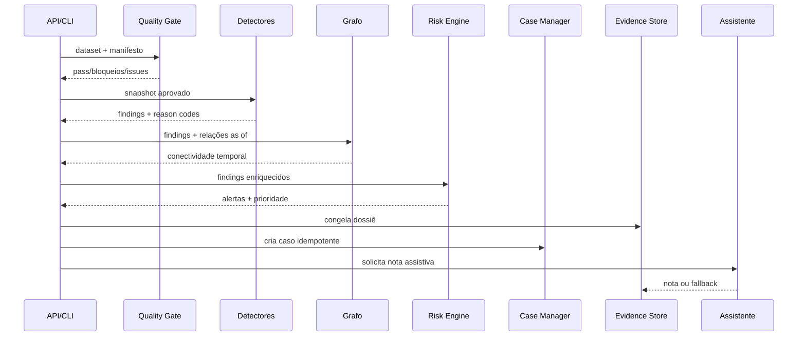
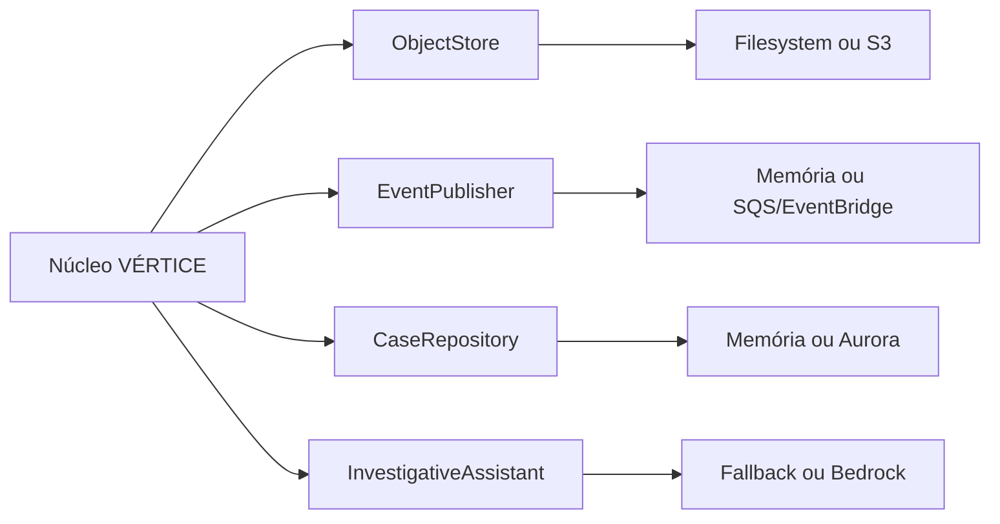

# Arquitetura do VÉRTICE

## Objetivo arquitetural

Executar o mesmo domínio localmente e na AWS. Detectores, contratos, política, correlação e workflow não importam SDKs de cloud. Infraestrutura entra por portas estreitas e testáveis.

## Componentes no repositório

| Módulo | Responsabilidade |
|---|---|
| `models.py` | contratos canônicos e objetos de domínio |
| `quality.py` | gates de qualidade, manifesto e reconciliação |
| `detectors/` | quatro detectores independentes |
| `graph.py` | enriquecimento relacional com vigência temporal |
| `risk.py` | correlação por sujeito e prioridade explicável |
| `cases.py` | idempotência, estados e quatro olhos |
| `audit.py` | ledger append-only encadeado por hash |
| `pipeline.py` | ordem de execução e degradação segura |
| `ports.py` | contratos de infraestrutura |
| `adapters/local.py` | filesystem, memória e fallback determinístico |
| `adapters/aws.py` | S3, SQS e Bedrock com clientes injetáveis |
| `config.py` | política validada, versionada e carregável |
| `api.py` | REST, Swagger e painel demonstrativo |

## Fluxo síncrono implementado



O dossiê é salvo antes da chamada assistiva. Se a última etapa falhar, o caso permanece íntegro.

## Portas e adaptadores



Adicionar AWS não requer mudar a assinatura de um detector. O bootstrap escolhe adaptadores conforme ambiente.

Exemplo conceitual:

```python
pipeline = SurveillancePipeline(
    object_store=S3ObjectStore(s3_client, bucket, prefix),
    event_publisher=SqsEventPublisher(sqs_client, queue_url),
    assistant=BedrockInvestigativeAssistant(bedrock_client, model_id),
    case_manager=CaseManager(aurora_repository, publisher),
    policy_config=load_policy("policy.approved.json"),
)
```

O adaptador Aurora e o cliente Neptune pertencem à fase de integração institucional porque dependem de schema, rede, IAM, RTO/RPO e padrões corporativos. Suas fronteiras já estão definidas; não são simulados como “produção pronta”.

## Semântica dos objetos

| Objeto | Pergunta | Persiste? |
|---|---|---|
| Evento | o que a fonte informou? | Raw/evidência |
| Feature | o que foi medido em qual janela/coorte? | snapshot versionado |
| Finding | qual detector encontrou qual padrão? | sim |
| Alert | quais findings relacionados merecem triagem? | sim |
| Case | qual unidade será investigada e decidida? | transacional |

Essa separação evita que uma regra isolada se torne automaticamente uma acusação ou tarefa.

## Idempotência e replay

IDs lógicos derivam de cenário, versão, sujeito, janela e snapshot. Reprocessar o mesmo snapshot com a mesma política produz os mesmos IDs de finding, alerta e caso. Timestamps operacionais mudam; identidade lógica não.

Um replay de produção também deve congelar:

- versão/commit do código;
- política e vigência;
- contratos e schema;
- snapshot das fontes;
- coorte e referência contemporânea;
- versão de entity resolution;
- modelo/prompt do assistente.

## Fail-safe

| Falha | Comportamento implementado/alvo |
|---|---|
| Duplicidade ou manifesto divergente | bloqueia processamento analítico |
| Referência crítica ausente | finding `INCONCLUSIVE` |
| Bedrock indisponível | nota fallback; caso continua |
| Relação não vigente | não entra no enriquecimento |
| Transição inválida | rejeitada antes de persistir |
| Autoaprovação | bloqueada pela regra de quatro olhos |
| SQS duplicar evento | IDs estáveis permitem consumidor idempotente |

## Duas velocidades

Esta versão executa o slice batch/replay em processo único. A evolução AWS separa:

- intradiário: Kinesis → features incrementais → findings → SQS;
- reconciliado: S3 → Glue/Data Quality → features históricas → replay;
- reconciliação: `CONFIRMED`, `ENRICHED`, `CORRECTED`, `RETRACTED_WITH_REASON` ou `LATE_FINDING`.

Os dois caminhos devem publicar o mesmo contrato de finding. Streaming não terá uma versão “menor” e semanticamente incompatível.

## O que não foi artificialmente abstraído

- Curvas, superfícies e pricing OTC são dependências institucionais.
- Coortes reais dependem de cobertura e taxonomia dos dados.
- Aurora exige desenho transacional e migrações aprovadas.
- Neptune exige volume, consultas e política de entity resolution reais.
- Retenção/Object Lock exigem decisão jurídica e de records management.

Esses itens estão roteados no plano AWS, mas não são marcados como concluídos.

