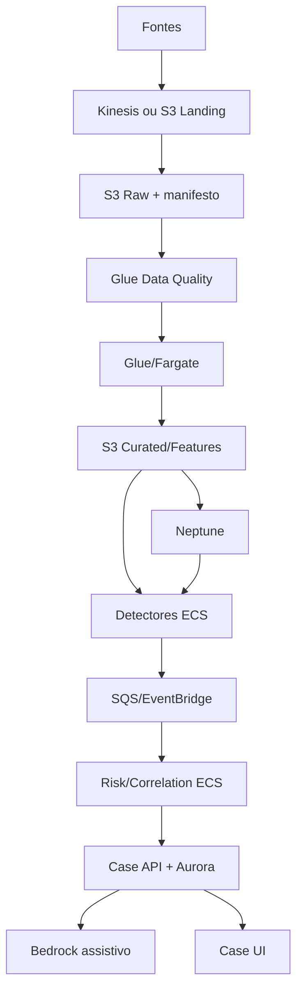

# Adoção AWS

## Princípio

A AWS hospeda capacidades; ela não redefine o domínio. A migração substitui adaptadores e separa workloads, preservando contratos, IDs, política e resultados esperados.

## Estado atual de cada fronteira

| Capacidade | Hoje | Próximo adaptador AWS | Estado honesto |
|---|---|---|---|
| Evidência JSON | filesystem atômico | S3/KMS | implementado e testado com cliente falso |
| Eventos de caso | memória | SQS | implementado e testado com cliente falso |
| Nota assistiva | fallback determinístico | Bedrock Runtime | implementado e valida citações permitidas |
| Casos | memória | Aurora PostgreSQL | porta pronta; schema institucional pendente |
| Grafo | memória temporal | Neptune | sem adaptador ainda; consultas/volume pendentes |
| Streaming | batch síncrono | Kinesis | contrato-alvo definido; consumidor pendente |
| Orquestração | pipeline em processo | Step Functions/ECS | imagem pronta; state machine pendente |
| Observabilidade | run report | CloudWatch/CloudTrail | métricas-alvo documentadas; instrumentação pendente |

“Porta pronta” significa que o núcleo não precisa mudar. Não significa que rede, segurança, DR e operação do serviço estejam concluídos.

## Execução da imagem

O container usa:

```text
uvicorn vertice_surveillance.bootstrap:app
```

O bootstrap lê ambiente e seleciona adaptadores. Para um teste AWS sem Aurora:

```text
VERTICE_ENV=aws-shadow
VERTICE_OBJECT_STORE=s3
VERTICE_EVENT_BUS=sqs
VERTICE_CASE_REPOSITORY=memory
VERTICE_AWS_REGION=sa-east-1
VERTICE_S3_BUCKET=<bucket>
VERTICE_S3_PREFIX=vertice-shadow
VERTICE_SQS_QUEUE_URL=<queue-url>
VERTICE_BEDROCK_MODEL_ID=<approved-model-id>
```

Esse modo serve apenas para integração/shadow. `memory` perde estado ao reiniciar e não é aceito como Case Manager de produção. O bootstrap falha explicitamente se alguém configurar `aurora` antes de instalar o adaptador aprovado.

## Mapeamento físico alvo



## Plano incremental

### Fase AWS-0 — pré-requisitos

- região/residência e landing zone aprovadas;
- classificação dos dados e owners;
- RTO/RPO e capacidade;
- contas/ambientes e connectivity;
- política KMS, logs e retenção;
- naming/tagging/FinOps;
- decisão de build versus integração do Case Manager.

### Fase AWS-1 — evidência e execução containerizada

- ECR e assinatura/scanning da imagem;
- ECS Fargate privado;
- S3 com Versioning, KMS e política de acesso;
- SQS + DLQ;
- CloudWatch logs/métricas;
- execução dos golden cases dentro do ambiente;
- comparação byte/semântica com o resultado local.

Gate: mesmo snapshot e política produzem os mesmos IDs, reason codes e prioridades.

### Fase AWS-2 — dados reais em shadow

- Landing/Raw/Quarantine/Standardized/Curated;
- manifestos por carga;
- Glue Data Catalog/Data Quality;
- reconciliação com origem;
- tokenização e acesso fino via Lake Formation;
- um cenário de concentração em shadow mode.

Gate: amostras rastreiam Curated → Raw → origem e reprocessam sem duplicação.

### Fase AWS-3 — caso transacional

- schema Aurora e migrações;
- optimistic locking;
- RLS/controles por domínio quando aplicável;
- API idempotente;
- quatro olhos, SLA, tarefas, comentários e anexos;
- backup/restauração testados;
- outbox transacional para eventos.

Gate: concorrência, reabertura, auditoria e restauração passam UAT.

### Fase AWS-4 — grafo e streaming

- ontologia e entity resolution aprovadas;
- carga Neptune e consulta `as of`;
- Kinesis para cenários T0/T1;
- consumer idempotente, lag, backpressure e DLQ;
- reconciliação intradiário versus batch.

### Fase AWS-5 — IA assistiva

- modelo aprovado em Bedrock;
- RAG de políticas separada da evidência do caso;
- output JSON validado;
- citation precision/coverage;
- redaction/PII e prompt injection tests;
- fallback, timeout e circuit breaker;
- logging de invocações decidido por Privacidade/Segurança.

## IAM mínimo para o slice de integração

O template em `deploy/aws/iam-task-policy.template.json` contém apenas ações de S3, SQS, KMS e Bedrock necessárias ao container. Recursos possuem placeholders e devem ser substituídos por ARNs específicos. Não use `Resource: "*"` em produção.

Separar:

- execution role do ECS: pull de imagem e logs;
- task role: acesso funcional do VÉRTICE;
- deploy role: criação/alteração de infraestrutura;
- roles humanas: operador, analista, revisor, auditor e administrador.

## S3 e imutabilidade

O adaptador grava JSON com SSE-KMS. A infraestrutura precisa definir:

- bucket policy e VPC endpoint;
- Versioning;
- Object Lock apenas após decisão de retenção;
- tags de classificação;
- lifecycle/Glacier conforme recuperação;
- access logs e CloudTrail data events quando aprovados;
- separação entre evidence e artefatos transitórios.

O código não decide prazo regulatório.

## Eventos

O envelope SQS contém `event_id`, `event_type` e `payload`. O `event_id` é determinístico. Em produção:

- consumidor mantém inbox/idempotency table;
- Case Manager usa transactional outbox;
- retry tem limite e DLQ;
- alarmes observam idade, lag e volume;
- payload grande vira referência S3, não corpo da mensagem.

## Aurora

O adaptador deve implementar `CaseRepository` e pelo menos:

- PK por `case_id` determinístico;
- controle de versão/lock;
- tabela append-only de transições;
- unique constraints de idempotência;
- outbox na mesma transação;
- timestamps do banco e identidade do ator;
- migrações reversíveis;
- queries de fila/SLA;
- política de acesso e auditoria.

Não mapear o JSON inteiro para uma única coluna e chamar isso de Case Manager.

## Neptune

Antes do provisionamento, medir:

- número de nós/arestas e crescimento;
- consultas interativas necessárias;
- latência e frequência;
- necessidade de Database versus Analytics;
- custo de rebuild a partir de Curated;
- falsa ligação de entity resolution;
- controles de acesso a atributos sensíveis.

O grafo é enriquecimento. Indisponibilidade não apaga findings; a política registra degradação.

## Critério de conclusão da migração

A solução não está “na AWS” apenas porque o container roda em ECS. Conclusão exige dados reconciliados, caso persistente, segurança, observabilidade, replay, backup/restore, runbooks, capacity test e aceite das funções de controle.

