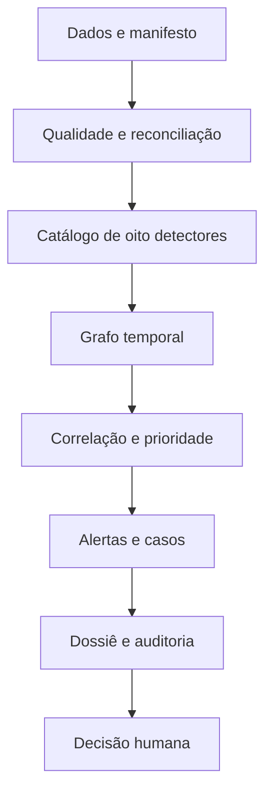

# VÉRTICE — visão executiva

## A decisão em uma página

O VÉRTICE demonstra uma forma diferente de construir Trade Surveillance: a regra não é a decisão e o alerta não é o produto final. A plataforma preserva evidências, mede comportamentos, correlaciona relações e entrega um caso reproduzível para decisão humana.

### O problema

Arquiteturas centradas em `operação → regra → alerta` transferem para o analista todo o trabalho de reconstrução. Elas também tendem a:

- gerar alertas duplicados para o mesmo comportamento;
- ignorar relacionamento, recorrência, liquidez e explicações benignas;
- esconder dados ausentes dentro de scores baixos;
- dificultar a reprodução da decisão meses depois;
- usar narrativa posterior para explicar uma regra opaca.

### O que foi construído

Uma solução executável que percorre:

Os quatro eixos originais — concentração, comportamento associado à manipulação,
atividade potencialmente excessiva e OTC complexo — foram preservados. A evolução
adiciona conduta de Renda Fixa, participação no universo observado, resposta de mercado
pós-negócio e principal versus cliente, além de referências temporais e papéis econômicos.

### Resultado demonstrado

Na execução de referência, 15 negócios listados, sete negócios de Renda Fixa e duas
estruturas OTC exercitam os oito cenários. A solução produz 11 findings, seis alertas e
seis casos. Um valuation incompleto entra em `AWAITING_EVIDENCE`, em vez de ser
classificado como baixo risco.

Esse resultado valida o comportamento do software, não eficácia regulatória. Os dados e thresholds são sintéticos e ilustrativos.

## O que muda para cada público

| Público | Mudança prática |
|---|---|
| Comitê | recebe risco, materialidade, backlog e limitações com semântica consistente |
| Surveillance | recebe dossiê, reason codes, evidências, contrafatos e dados ausentes |
| Compliance/Riscos | separa hipótese técnica de conclusão jurídica e registra challenge |
| Model Risk | consegue versionar, reproduzir e comparar política, features e outcomes |
| Auditoria | percorre caso → alerta → finding → evidência e verifica o hash chain |
| Tecnologia | evolui detectores sem acoplar domínio a S3, SQS, Neptune ou Bedrock |
| Engenharia iniciante | encontra contratos explícitos, comandos simples e testes por comportamento |

## Benefícios que precisam ser medidos

O projeto não assume valor por arquitetura. Um piloto real deve medir:

| Hipótese | Métrica antes/depois |
|---|---|
| Correlação reduz duplicação | alertas agrupados por caso e duplicação evitada |
| Dossiê reduz esforço | tempo mediano de preparação e de triagem |
| Contexto melhora qualidade | precisão em amostra adjudicada por cenário/coorte |
| Ausência explícita reduz erro | percentual inconclusivo e tempo para obter evidência |
| Replay melhora governança | casos reproduzidos com mesma versão |
| Assistente ajuda sem inventar | tempo poupado, citation coverage e unsupported claim rate |

Redução de alertas, isoladamente, não é sucesso. Ela deve ser lida com cobertura, recall em biblioteca de cenários, materialidade e SLA.

## Guardrails não negociáveis

1. Finding não é acusação.
2. Prioridade não é probabilidade de culpa.
3. Ausência de dado crítico gera `INCONCLUSIVE`.
4. IA não abre, fecha, comunica ou altera evidências.
5. Decisões críticas exigem quatro olhos.
6. Thresholds e pesos têm versão.
7. Toda alegação do resumo assistivo precisa apontar para evidência autorizada.
8. Spoofing/layering não são alegados sem lifecycle de ordens e livro.

## Decisão recomendada

Usar o VÉRTICE como **baseline executável para discovery e piloto em shadow mode**,
iniciando pelo slice de Renda Fixa com melhor qualidade de referência e cobertura. O
próximo investimento deve ser em dados reais autorizados, reconciliação, convenções por
produto, coortes e adjudicação — não em mais complexidade de modelo.

O primeiro gate de valor é simples: um slice vertical precisa ser reproduzível, explicável e considerado útil por analistas em uma amostra real. A AWS entra depois desse comportamento estar validado, por meio dos adaptadores já separados.
