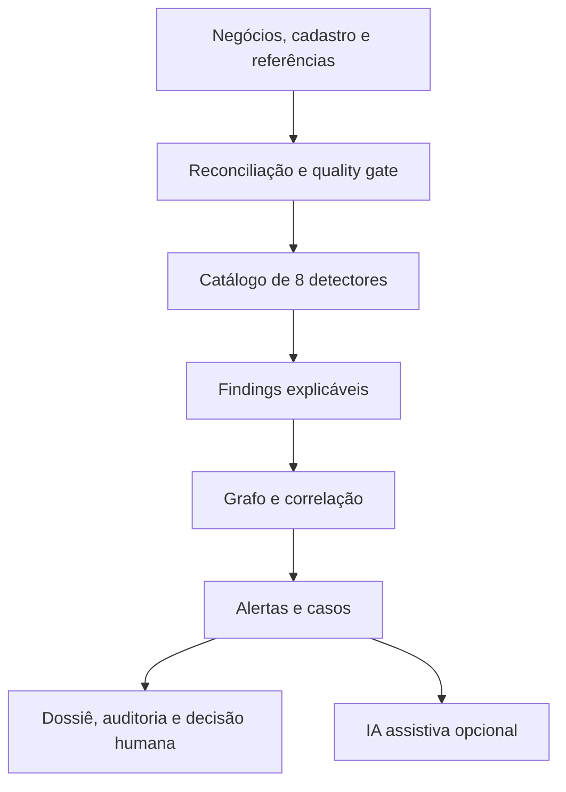

# VÉRTICE para Tesouraria e Renda Fixa

## O que mudou

O VÉRTICE mantém integralmente a baseline de mercado listado, churning e OTC e
adiciona uma camada especializada para Tesouraria. A evolução transforma os pontos
levantados nos insights em contratos, detectores, quality gates, golden cases e testes
executáveis.

O resultado não recebe “POC” no nome. **VÉRTICE** é o nome da solução; o estágio atual
é uma implementação de validação controlada, preparada para ser acoplada à AWS por
adaptadores, sem alegar que os componentes transacionais cloud já estão implantados.

### Leitura rápida por público

| Público | O que precisa reter |
|---|---|
| Diretoria/CTO | a solução preserva investimento, amplia Tesouraria e mantém implantação AWS evolutiva |
| Surveillance/Compliance | cada sinal traz cálculo, reason codes, evidências, dados ausentes e limites |
| Tesouraria/Produto | PU, taxa, spread, duration, DV01, curva, emissor, papel econômico e capacidade estão no domínio |
| Engenharia/Dados | contratos Pydantic, política JSON, no-look-ahead, replay e interfaces desacopladas |
| Model Risk/Auditoria | metodologia versionada, neutralidade, caminhos inconclusivos e gates de validação |
| Novo integrante | pense em três perguntas: quem negociou, contra qual referência e com qual cobertura? |

## Resultado de referência

Com dados sintéticos e determinísticos, a execução demonstra:

| Indicador | Resultado |
|---|---:|
| Negócios listados | 15 |
| Negócios de Renda Fixa | 7 |
| Cenários exercitados | 8/8 |
| Findings técnicos | 11 |
| Alertas correlacionados | 6 |
| Casos investigativos | 6 |
| Testes automatizados | 35 |

Esses números validam comportamento do software, não eficácia regulatória em dados
reais. O conjunto benigno continua sem produzir findings ou casos.

## Arquitetura funcional



A referência de mercado e a resolução das pontas são serviços de fundação usados pelos
detectores de Tesouraria. Eles não são atalhos para uma conclusão.

## O que foi preservado e o que foi adicionado

| Capacidade | Situação |
|---|---|
| Concentração relacional | preservada |
| Comportamento associado à manipulação | preservado |
| Churning/atividade potencialmente excessiva | preservado |
| OTC complexo | preservado |
| Conduta de Renda Fixa | adicionado |
| Participação no universo observado | adicionado |
| Resposta de mercado pós-negócio | adicionado |
| Principal versus cliente | adicionado |
| Referência temporal de Renda Fixa | adicionado |
| Duas pontas e papel econômico | adicionado |
| Contratos AWS S3/SQS/Bedrock | preservados |
| Aurora, Neptune, Kinesis e operação produtiva | arquitetura alvo; não implementados nesta etapa |

## Contratos de domínio

### Negócio de Renda Fixa

`FixedIncomeTrade` responde explicitamente:

- qual produto e emissor foram negociados;
- quem comprou e quem vendeu;
- se cada ponta é cliente, Tesouraria proprietária, related party, instituição,
  market maker, broker ou desconhecida;
- se a capacidade é agency, principal, riskless principal ou desconhecida;
- qual mesa, book e trader participaram;
- qual PU, quantidade e financeiro foram registrados;
- quais taxa, spread, duration e DV01 estavam associados;
- quando o negócio, atualização da origem e ingestão ocorreram.

Isso elimina uma ambiguidade crítica: “cliente comprou” não é suficiente para saber se
o banco agiu como agente, principal ou contraparte econômica.

### Referência de mercado

`FixedIncomeReference` registra:

- instrumento e produto;
- `reference_time`;
- PU, taxa e/ou spread;
- curva benchmark, duration e DV01 quando disponíveis;
- fonte, versão metodológica, freshness e confiança.

O serviço `FixedIncomeReferenceService` possui duas operações:

1. `latest_at`: seleciona a referência mais recente conhecida até o instante do negócio;
2. `first_after`: seleciona a primeira referência posterior dentro de um horizonte.

`latest_at` jamais usa uma referência futura. Uma referência velha além da política é
tratada como `STALE`, não como dado válido.

### Cobertura do denominador

`MarketCoverageSnapshot` declara fonte, janela, universo e `coverage_ratio`. Os
universos suportados são:

- `INTERNAL_OBSERVED`: somente o fluxo interno disponível;
- `REGULATORY_REPORTED`: conjunto reportado por fonte regulatória/autorregulatória;
- `VENUE_COMPLETE`: feed declarado completo para o venue e a janela.

Mesmo com cobertura alta, o finding usa o termo **participação observada**. Sem snapshot
de cobertura, o detector pode identificar um sinal forte, mas o devolve como
`INCONCLUSIVE`.

## Os oito detectores

| Cenário | Pergunta | Saída responsável |
|---|---|---|
| `CONCENTRATION` | há recorrência e concentração por contraparte? | padrão relacional, não conluio |
| `MANIPULATION_BEHAVIOR` | preço, direção, participação e posição formam padrão composto? | comportamento associado, não manipulação provada |
| `CHURNING` | turnover, custo e reversões parecem excessivos? | prioridade investigativa, não conclusão de churning |
| `OTC_COMPLEX` | execução diverge de valuation independente e suitability? | finding ou valuation inconclusivo |
| `FIXED_INCOME_CONDUCT` | PU, taxa ou spread divergem da referência contemporânea? | desvio para revisão, não preço injusto |
| `FIXED_INCOME_OBSERVED_PARTICIPATION` | a parte concentra financeiro, quantidade e negócios no universo disponível? | participação observada, não dominância |
| `FIXED_INCOME_POST_TRADE_RESPONSE` | movimentos posteriores se alinham repetidamente ao lado negociado? | associação temporal, não causalidade |
| `PRINCIPAL_CUSTOMER_CONDUCT` | cliente negocia repetidamente contra a Tesouraria com desvio adverso? | sinal de conduta, não conflito provado |

## Como os detectores de Tesouraria calculam

### 1. Conduta de Renda Fixa

Para uma referência de PU disponível no instante do negócio:

$$
\text{desvio PU em bps} =
\frac{|PU_{negócio} - PU_{referência}|}{PU_{referência}} \times 10.000
$$

Para taxa e spread, a solução calcula a distância absoluta em bps. Um reason code é
emitido apenas quando o limiar versionado é ultrapassado. Ausência de referência gera
um finding inconclusivo.

### 2. Participação observada

São calculados três denominadores independentes:

$$
participação_{financeiro} = \frac{financeiro_{parte}}{financeiro_{universo\ observado}}
$$

O mesmo é feito para quantidade e contagem de negócios. O sinal exige quantidade
mínima de negócios e pelo menos dois limiares. A cobertura do universo aparece nas
features e nas evidências.

### 3. Resposta pós-negócio

Para compra, alta posterior de PU é considerada alinhada; para venda, queda posterior.
Movimento de taxa tem sinal econômico invertido. O detector exige repetição dentro do
horizonte configurado e registra a limitação:

> associação temporal não implica influência ou causalidade.

### 4. Principal versus cliente

O fluxo só entra quando uma ponta é `CLIENT` e a outra é `TREASURY_PROP`. Para compra
do cliente, preço acima da referência é adverso; para venda, preço abaixo da referência
é adverso. O detector exige repetição e benchmark contemporâneo.

O resultado não afirma conflito de interesse, vantagem indevida ou execução injusta.
Liquidez, tamanho, mandato e hedge continuam sendo análise humana obrigatória.

## Falha segura

| Situação | Comportamento |
|---|---|
| trade_id duplicado | bloqueio crítico do catálogo afetado |
| manifesto não reconcilia | bloqueio crítico e issue auditável |
| referência ausente ou velha | finding `INCONCLUSIVE` nos cenários dependentes |
| referência posterior ao negócio | ignorada por `latest_at` |
| cobertura do denominador ausente | participação fica `INCONCLUSIVE` |
| papel econômico desconhecido | quality issue e limitação de principal versus cliente |
| IA indisponível | caso e dossiê permanecem; entra fallback determinístico |
| evidência parcial | `DEGRADED` ou `INCONCLUSIVE`, nunca “zero risco” silencioso |

## Exemplo investigativo da demonstração

O golden case `CLIENT-FI` compra a mesma debênture três vezes contra
`TREASURY-DESK`. O conjunto sintético foi desenhado para exercitar:

1. desvio de PU, taxa e spread frente à referência contemporânea;
2. participação relevante em financeiro, quantidade e negócios no universo declarado;
3. respostas posteriores alinhadas ao lado comprador;
4. execução principal versus cliente com desvio adverso;
5. correlação dos quatro findings em um caso do cliente;
6. findings próprios da mesa sem duplicar o negócio no denominador de mercado.

O analista recebe os registros dos negócios e referências utilizados, os valores das
features, a versão da política e as limitações. A decisão final permanece humana.

## Adoção AWS sem reescrever o domínio

O núcleo usa interfaces; a adoção AWS troca adaptadores e topologia, não fórmulas nem
contratos de finding.

| Função | Agora | AWS alvo |
|---|---|---|
| Arquivos e evidências | filesystem JSON | S3, Versioning, KMS e Object Lock |
| Eventos | publisher em memória | SQS/EventBridge; Kinesis quando houver streaming |
| Orquestração | processo síncrono/Docker | ECS Fargate e Step Functions |
| Casos | repositório em memória | Aurora PostgreSQL com outbox e optimistic locking |
| Grafo | enriquecedor em memória | Neptune após validar modelo e consultas |
| Assistente | resumo determinístico | Bedrock com RAG, guardrails e avaliação |
| Observabilidade | relatório e logs | CloudWatch, CloudTrail, métricas e alarmes |

### Sequência recomendada

1. levar o mesmo container para ECS em ambiente de teste;
2. substituir evidência local por S3 e eventos por SQS/EventBridge;
3. integrar uma fonte real autorizada e reconciliar um dia completo;
4. executar shadow mode sem alterar fila regulatória;
5. implantar Aurora/outbox e workflow multiusuário;
6. adicionar Neptune apenas quando as consultas de relacionamento estiverem validadas;
7. habilitar Bedrock por último, fora do caminho decisório.

Nenhum item dessa lista deve ser descrito como concluído antes de implantação, teste de
segurança, DR, escala, custos e aceite dos owners.

## Critérios de entrada para piloto

- owner e contrato de cada fonte definidos;
- reconciliação de contagem e financeiro aprovada;
- convenções de taxa, calendário, day count e PU formalizadas por produto;
- fonte e metodologia de referência aprovadas por Tesouraria/Produto/Model Risk;
- actor type e execution capacity com cobertura mensurada;
- replay `as of` sem look-ahead;
- golden cases reais autorizados, benignos difíceis e casos incompletos adjudicados;
- thresholds aprovados por coorte, não copiados da demonstração;
- capacidade operacional da fila e SLA avaliados;
- LGPD, acesso, retenção e legal hold aprovados;
- rollback e observabilidade exercitados.

## O que ainda falta por produto

| Produto | Referência mínima para evolução |
|---|---|
| Debênture | PU, taxa, spread, duration, emissor, rating e liquidez |
| LF | curva, indexador, prazo, emissor e liquidez |
| CRI/CRA | curva, emissor/devedor, rating, estrutura e liquidez |
| Títulos públicos | curva soberana, PU, taxa, duration e calendário |
| Derivativos | preço teórico, volatilidade, curva de juros, parâmetros e IPV |

A implementação atual suporta o contrato comum, mas a metodologia de cada produto
precisa ser construída e aprovada antes de produção.

## Como apresentar em oito minutos

1. **Problema:** “Tesouraria exige semântica de PU, taxa, spread, duas pontas e
   referências contemporâneas; preço genérico não basta.”
2. **Preservação:** mostre que os quatro detectores originais continuam presentes.
3. **Evolução:** mostre os quatro novos cenários e o serviço de referência temporal.
4. **Caso:** execute `vertice demo --policy configs/policy.example.json` e abra o caso
   `CLIENT-FI`.
5. **Credibilidade:** destaque no-look-ahead, coverage ratio e caminhos inconclusivos.
6. **Governança:** mostre reason codes, evidence refs, política, audit chain e quatro olhos.
7. **AWS:** explique a troca de adaptadores e a sequência de adoção, sem chamar alvo de
   implementado.
8. **Fechamento:** “o que validamos hoje é comportamento, rastreabilidade e capacidade
   de evolução; eficácia real virá de shadow mode e adjudicação.”

## Frases que podem e não podem ser usadas

| Use | Não use |
|---|---|
| “identifica padrões para investigação” | “detecta fraude” |
| “participação no universo observado” | “market dominance” ou “market share” sem fonte completa |
| “resposta pós-negócio associada” | “o cliente influenciou o preço” |
| “desvio adverso em fluxo principal versus cliente” | “houve conflito ou preço injusto” |
| “preparada para adoção AWS” | “production-ready na AWS” |
| “35 testes com dados sintéticos” | “95% de precisão/cobertura regulatória” |

## Comandos de validação

```bash
python -m pip install -e ".[dev]"
ruff check src tests
mypy src
pytest -q
python -m build
vertice demo --policy configs/policy.example.json
vertice validate --dataset benign
```

O CI executa o mesmo conjunto principal em cada pull request.
